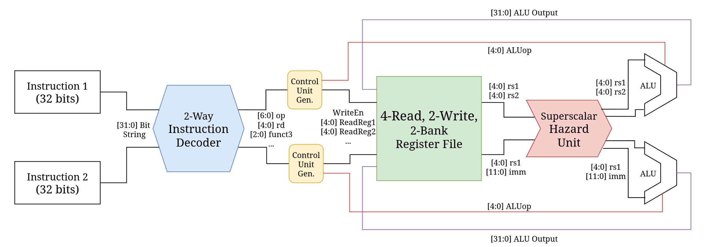

# RISC-V-Superscalar-32x32-Register-File-ALU

This repository aims to implement a superscalar 4-Read/2-Write register file. If implemented correctly, two different RISC-V instructions should be able to execute completely in parallel. This is different than pipelining, in that the instructions completely overlap with one another rather than stagger in multiple stages.

  

# System Requirements
* SystemVerilog Compiler
    * Modelsim, AMD Vivado, Intel Quartus Prime / Questa, Cadence Xcellium, Synopsys VCS, etc.
    * (personally tested with both Modelsim & AMD Vivado)
    * (Icarus Verilog does **not** work as it is not compatible with SystemVerilog interfaces)
* Waveform Viewer
    * GTKWave, Modelsim, AMD Vivado, Intel Quartus Prime / Questa, Cadence Xcellium, Synopsys VCS, etc.
    * (personally tested using both GTKWave & Modelsim on Arch Linux 2025.07.01)
# Overview
### <ins> Project Rationale:</ins>

### <ins> Project Summary:</ins>

# References
* d
* d
* d
* d
* d
* d
