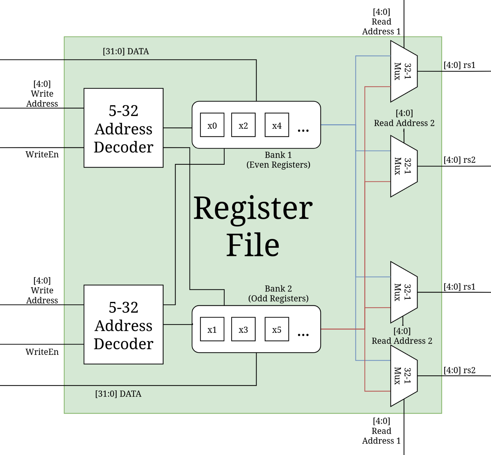

# RISC-V-Superscalar-32x32-Register-File-ALU

This repository aims to implement a superscalar 4-Read/2-Write register file. If implemented correctly, two different RISC-V instructions should be able to execute completely in parallel. This is different than pipelining, in that the instructions completely overlap with one another rather than stagger in multiple stages.

  

# System Requirements
* SystemVerilog Compiler
    * Modelsim, AMD Vivado, Intel Quartus Prime / Questa, Cadence Xcellium, Synopsys VCS, etc.
    * (personally tested with both Modelsim & AMD Vivado)
    * (Icarus Verilog does **not** work as it is not compatible with SystemVerilog interfaces)
* Waveform Viewer
    * GTKWave, Modelsim, AMD Vivado, Intel Quartus Prime / Questa, Cadence Xcellium, Synopsys VCS, etc.
    * (personally tested using both GTKWave & Modelsim on Arch Linux 2025.07.01)
# Overview
### <ins> Project Rationale:</ins>
Pipelining is a crucial part of material that is usually covered in an undergraduate computer organization course. Superscalar processors are another way to massively increase throughput, yet they are not the primary focus when compared to pipelining. This project was implemented in an attempt to better understand these types of processors. A diagram of the superscalar register file is shown below:

  

# References
* ['The 8-Bit, 32 Word Register File' - Brian Wolak (Website Article)](https://cmosedu.com/jbaker/courses/ee421L/f21/students/wolak/proj/proj.html)
* ['A scalable register file architecture for superscalar processors' - Steven Wallace, et al. (Paper)](https://www.sciencedirect.com/science/article/abs/pii/S0141933198000489)
* ['How a Register File Works – Superscalar 8-Bit CPU #16' - Fabian Schuiki (YouTube)](https://www.youtube.com/watch?v=mlAd3TEX9sg)
